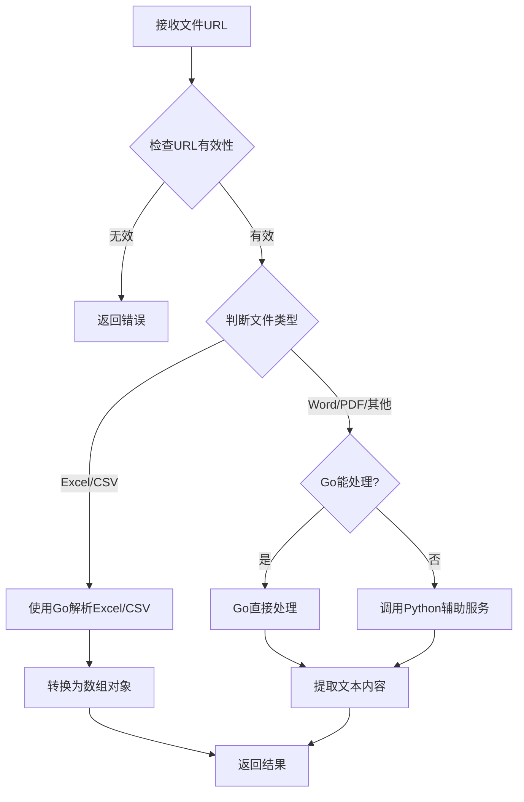

# 文件URL解析服务

这是一个基于Go和Python的文件URL解析服务，能够解析多种格式的文件内容。

## 功能特点

- 支持解析Excel文件为JSON数组对象，自动识别日期格式
- 支持解析Word、PDF、Markdown、TXT等文本文件
- 提供简单的RESTful API接口
- 使用Go作为主服务，Python作为辅助服务处理复杂文件格式
- 智能处理日期格式：将"1998/9/9 12:30:05"格式转换为"1998-09-09 12:30:05"
- 自动将逗号分隔的内容转换为JSON数组
- 支持自定义Excel/CSV文件最大解析行数，可通过接口参数指定
- 支持分页获取大型Excel/CSV文件数据，避免一次性加载过多数据
- 支持控制是否使用表头作为键，可选择使用统一格式的键名（Col_1, Col_2...）
- 按表头顺序输出数据，保证JSON响应中的字段顺序与Excel/CSV表头一致
- 当使用统一格式键名（Col_X）时，确保按照数字顺序排序，而非字典序
- 智能检测表格数据的实际起始位置，支持解析不从左上角开始的表格数据
- 内置API速率限制，默认限制为240次/秒，可通过配置调整
- 支持解析Word旧版格式(.doc)文件，使用轻量级的antiword工具
- 优化表格检测逻辑，特别支持从左上角开始的表格结构和合并单元格的表头
- 智能动态识别主字段和明细字段，自动处理两行表头结构的Excel/CSV文件

## 数据处理特性

### 日期格式处理
- 只对格式为带有"/"的日期进行转换为"-"分隔的标准格式，支持以下格式：
  - 年/月/日 时:分:秒 → 年-月-日 时:分:秒（如 1998/9/9 12:30:05 → 1998-09-09 12:30:05）
  - 年/月/日 时:分 → 年-月-日 时:分（如 1998/9/9 12:30 → 1998-09-09 12:30）
  - 年/月/日 时 → 年-月-日 时（如 1998/9/9 12 → 1998-09-09 12）
  - 年/月/日 → 年-月-日（如 1998/9/9 → 1998-09-09）
  - 年/月 → 年-月（如 1998/9 → 1998-09）
  - 年/ → 年（如 1998/ → 1998）
- 如果已经是带有"-"的标准格式则保持不变
- 其他格式的日期（如 "2023年4月5日"）直接原样输出

### 逗号分隔内容处理
- 自动检测逗号分隔的内容并转换为数组格式
- 例如 "member1@company.com,member2@company.com,member3@company.com" 会被转换为 ["member1@company.com","member2@company.com","member3@company.com"]
- 特别适用于URL字段，如 "https://example.com/1.jpg,https://example.com/2.jpg" 会被转换为 ["https://example.com/1.jpg","https://example.com/2.jpg"]
- 系统会在Excel/CSV解析过程中自动处理所有包含逗号的字符串字段，无需额外配置

### 表格起始位置自动检测
- 智能检测Excel/CSV表格中数据的实际起始位置，不要求数据必须从A1单元格开始
- 自动识别表头行和数据起始列，适用于各种布局的表格
- 能够处理在表格中间位置（如D10单元格附近）开始的数据
- 自动跳过空行和空列，只处理有效数据
- 确保正确识别表头和对应的数据列，保证解析结果的准确性
- 优先检测从左上角开始的标准表格结构
- 特别支持第一行为合并单元格表格标题，第二行为表格列头的常见结构
- 动态识别主字段和明细字段，无需预定义字段名称

## 支持的文件格式

- Excel (.xlsx, .xls)：解析为数组对象，表头为键，每行为对应的键值对
- Word (.docx, .doc)：解析为文本内容，包括旧版和新版格式
- PDF (.pdf)：解析为文本内容
- Markdown (.md)：解析为原始Markdown文本
- 文本文件 (.txt)：解析为文本内容

## 项目结构

```
file-url-parser/
├── cmd/
│   └── main.go               # 启动入口
├── config/
│   └── config.go             # 配置加载
├── controller/
│   └── handler.go            # 路由处理逻辑
├── model/
│   └── model.go              # 数据结构定义
├── service/
│   ├── excel_parser.go       # Excel解析服务
│   ├── text_parser.go        # 文本解析服务
│   └── parser_service.go     # 解析服务主逻辑
├── router/
│   └── router.go             # 路由注册
├── utils/
│   └── helper.go             # 工具函数
├── python_ext/               # Python辅助服务
│   ├── app/
│   │   └── main.py           # Python服务入口
│   └── requirements.txt      # Python依赖
├── Dockerfile                # Go服务Dockerfile
├── Dockerfile.python         # Python服务Dockerfile
├── docker-compose-file-url-parser.yml # Docker Compose配置
├── .dockerignore
└── README.md
```

## 接口说明

### 🧩 接口 /fileProcess/parse

- 方法：POST
- 描述：解析文件URL的内容
- 请求体：
  ```json
  {
    "url": "https://example.com/path/to/file.xlsx",
    "use_header_as_key": true,
    "max_rows": 500,
    "offset": 0,
    "limit": 100,
    "has_table_header": false
  }
  ```
  > `use_header_as_key` 参数为可选，默认为 true。设置为 false 时，将使用统一格式的键名（Col_1, Col_2...）代替原始表头。
  > 
  > `max_rows` 参数为可选，用于指定Excel/CSV文件最大允许解析的行数。不指定时使用系统默认值（200行）。设置为 -1 表示无限制，但请注意大型文件可能会影响性能。
  >
  > `offset` 参数为可选，默认为 0，表示从第一行数据开始读取（不包括表头）。
  >
  > `limit` 参数为可选，表示每次返回的数据行数。不指定时返回所有符合条件的数据行。
  >
  > `has_table_header` 参数为可选，默认为 false。设置为 true 时，将检测并处理表格行表头（适用于包含子表格的Excel/CSV文件）。

- 响应示例（标准格式）：
  ```json
  {
    "data": [
      {
        "订单人": "T001",
        "订单日期": "2025-01-01",
        "总金额": 4000,
        "申请人": "张三"
      },
      {
        "订单人": "T0002",
        "订单日期": "2024-08-09",
        "总金额": 200,
        "申请人": "李四"
      }
    ],
    "headers": ["订单人", "订单日期", "总金额", "申请人"]
  }
  ```

- 响应示例（包含表格行）：
  ```json
  {
    "data": [
      {
        "订单人": "T001",
        "订单日期": "2025-01-01",
        "总金额": 4000,
        "表格": [
          {
            "产品名称": "产品1",
            "数量": 1,
            "单价": 200
          },
          {
            "产品名称": "产品2",
            "数量": 2,
            "单价": 3800
          }
        ],
        "申请人": "张三"
      },
      {
        "订单人": "T0002",
        "订单日期": "2024-08-09",
        "总金额": 200,
        "表格": [
          {
            "产品名称": "产品1",
            "数量": 1,
            "单价": 200
          }
        ],
        "申请人": "李四"
      }
    ],
    "headers": ["订单人", "订单日期", "总金额", "表格", "申请人"],
    "table_headers": ["产品名称", "数量", "单价"]
  }
  ```
  > 注意：响应中的数据字段顺序与表头顺序一致，便于前端展示。当 `use_header_as_key=false` 时，`headers` 将是 `["Col_1", "Col_2", "Col_3"]`，而 `original_headers` 将保留原始表头。系统确保 Col_X 格式的键名按照数字顺序排列（如 Col_1, Col_2, ..., Col_10, Col_11），而不是字典序（Col_1, Col_10, Col_11, Col_2...）。

- 响应（文本文件）：
  ```json
  {
    "content": "文件的文本内容..."
  }
  ```

- 错误响应：
  ```json
  {
    "error": "错误信息"
  }
  ```

## 🔧 模块说明

### controller/handler.go
- 功能：处理HTTP请求，验证URL参数
- 调用链：router → controller → service

### service/parser_service.go
- 功能：主要的解析逻辑，根据文件类型调用不同的解析器
- 调用链：controller → parser_service → excel_parser/text_parser

### service/excel_parser.go
- 功能：解析Excel文件为数组对象
- 特点：自动识别日期格式，支持数值转换

### service/text_parser.go
- 功能：处理文本文件和复杂文件格式
- 特点：调用Python辅助服务处理Word和PDF等格式

### python_ext/app/main.py
- 功能：Python辅助服务，处理复杂文件格式
- 支持：Word (.docx, .doc)、PDF、Markdown等格式解析
- 使用轻量级工具：python-docx处理.docx文件，antiword处理.doc文件，PyPDF2处理PDF文件

## 部署说明

### 环境要求

- Docker 和 Docker Compose
- 外部网络：api-proxy_proxy_net（可根据需要修改）

### Docker 部署

#### 构建和启动服务

1. 构建Docker镜像：

```bash
docker-compose -f docker-compose-file-url-parser.yml build
```

2. 启动服务：

```bash
docker-compose -f docker-compose-file-url-parser.yml down
docker-compose -f docker-compose-file-url-parser.yml up -d
```

#### 服务说明

- Go主服务：
  - 容器名称：file-url-parser-go
  - 端口：4001
  - 环境变量：
    - PORT：服务端口
    - PYTHON_SERVICE_URL：Python辅助服务URL
    - MAX_FILE_SIZE：最大文件大小（字节）
    - MAX_ALLOWED_ROWS：Excel/CSV文件最大允许解析的数据行数，默认为 200

- Python辅助服务：
  - 容器名称：file-url-parser-python
  - 端口：4002

### 本地开发与测试

如果您想在本地运行该服务进行开发或测试，可以按照以下步骤操作：

#### 1. 准备环境

首先，您需要安装以下软件：

- Go 语言环境（建议 Go 1.16 或更高版本）
- Python 3.7 或更高版本（用于辅助服务）
- 相关依赖包

#### 2. 启动 Go 主服务

1. 进入项目根目录

2. 安装 Go 依赖：
   ```bash
   go mod tidy
   ```

3. 编译并启动 Go 服务：
   ```bash
   go run cmd/main.go
   ```

   或者，您也可以先构建再运行：
   ```bash
   go build -o file-url-parser cmd/main.go
   ./file-url-parser
   ```

   默认情况下，Go 服务会在 4001 端口启动。您可以通过设置环境变量来修改：
   ```bash
   export PORT=4001
   export PYTHON_SERVICE_URL=http://localhost:4002
   export MAX_FILE_SIZE=10485760  # 10MB
   export MAX_ALLOWED_ROWS=200  # 默认200行
   ```

#### 3. 启动 Python 辅助服务

1. 进入 Python 服务目录：
   ```bash
   cd python_ext
   ```

2. 安装 Python 依赖：
   ```bash
   pip3 install -r requirements.txt
   ```

   如果需要处理.doc文件，还需要安装antiword工具：
   ```bash
   # 在Ubuntu/Debian系统上
   sudo apt-get install antiword
   
   # 在macOS上
   brew install antiword
   
   # 在CentOS/RHEL系统上
   sudo yum install antiword
   ```

3. 启动 Python 服务：
   ```bash
   python3 app/main.py
   ```

   Python 服务默认在 4002 端口启动。

#### 4. 开发模式（可选）

如果您是在开发模式下运行，可以使用以下命令实现热重载：

对于 Go 服务，可以使用 air 工具：
```bash
# 安装 air
go install github.com/cosmtrek/air@latest

# 使用 air 启动服务
air
```

对于 Python 服务，可以使用 uvicorn 的开发模式：
```bash
cd python_ext
uvicorn app.main:app --reload --port 4002
```

#### 5. 常见问题处理

- 如果遇到端口冲突，可以修改 PORT 环境变量
- 确保 Go 服务能够正确连接到 Python 服务
- 检查是否安装了所有必要的依赖包
- 如果遇到函数重复声明的编译错误（如 `isLikelyDate redeclared in this block`），这是因为相同的函数在 `excel_parser.go` 和 `csv_parser.go` 中都有定义。解决方法是删除 `csv_parser.go` 中的重复函数，只保留 `excel_parser.go` 中的函数定义。
- 如果遇到 `"xxx" imported and not used` 错误，需要删除未使用的包导入。特别是在删除了 `csv_parser.go` 中的函数后，可能会导致 `strings` 和 `time` 包不再被使用，需要从导入列表中删除。

## 调用示例

### 基本用法

```bash
curl -X POST http://localhost:4001/fileProcess/parse \
  -H "Content-Type: application/json" \
  -d '{"url":"https://example.com/path/to/file.xlsx"}'
```

### 分页获取大型Excel/CSV文件数据

对于大型Excel/CSV文件，可以设置`max_rows=-1`表示不限制行数，然后使用`offset`和`limit`参数分页获取数据：

```bash
# 获取前100行数据
curl -X POST http://localhost:4001/fileProcess/parse \
  -H "Content-Type: application/json" \
  -d '{"url":"https://example.com/path/to/large-file.xlsx", "max_rows": -1, "offset": 0, "limit": 100}'

# 获取接下来的100行数据
curl -X POST http://localhost:4001/fileProcess/parse \
  -H "Content-Type: application/json" \
  -d '{"url":"https://example.com/path/to/large-file.xlsx", "max_rows": -1, "offset": 100, "limit": 100}'
```

当`offset`超出文件实际行数时，会返回空数组。

## 流程图



### 环境变量配置

服务支持以下环境变量配置：

- `PORT`：服务端口，默认为 4001
- `PYTHON_SERVICE_URL`：Python辅助服务URL，默认为 http://localhost:4002
- `MAX_FILE_SIZE`：最大文件大小（字节），默认为 10MB (10485760)
- `MAX_ALLOWED_ROWS`：Excel/CSV文件最大允许解析的数据行数，默认为 200
- `USE_HEADER_AS_KEY`：是否默认使用表头作为键，默认为 true
- `GIN_MODE`：Gin框架运行模式，设置为 release 用于生产环境
- `RATE_LIMIT`：API接口调用频率限制，默认为 240次/秒

这些环境变量可以在部署时设置，例如：

```bash
export RATE_LIMIT=300  # 设置API调用限制为300次/秒
export GIN_MODE=release  # 设置Gin为发布模式
export MAX_ALLOWED_ROWS=500  # 设置允许解析的最大行数为500行
go run cmd/main.go
```

或者在Docker环境中：

```yaml
# docker-compose-file-url-parser.yml
services:
  file-url-parser-go:
    environment:
      - RATE_LIMIT=300  # 设置API调用限制为300次/秒
      - GIN_MODE=release  # 设置Gin为发布模式
      - MAX_ALLOWED_ROWS=500  # 设置允许解析的最大行数为500行
```

## 表格行功能说明

本系统现已支持解析包含表格行的Excel/CSV文件，适用于具有主表和子表结构的数据。

### 功能特点

- **自动检测表格行**：系统可以自动检测Excel/CSV文件中的表格行结构，包括表头和数据行。
- **支持多种表格布局**：支持表格列在任意位置开始的情况，以及表格表头可能占用一行或多行的情况。
- **智能数据合并**：将主数据行和对应的表格行数据合并为一个完整的数据结构，便于前端展示和处理。
- **保持原始表头**：可以选择使用原始表头或统一格式的键名（Col_1, Col_2...）。

### 使用方法

1. 在请求中设置 `has_table_header=true` 参数，启用表格行检测功能。
2. 系统将自动检测表格行结构，并将表格数据作为子数组返回。
3. 表格数据将以字段名（如"表格"）为键，包含在主数据项中。

### 支持的表格结构

系统支持以下几种常见的表格结构：

1. **标准表格结构**：主表头在第一行，表格表头在第二行，数据从第三行开始。
   ```
   订单人 | 订单日期  | 总金额 | 订单明细 | 申请人
   ------+----------+-------+----------+------
         |          |       | 产品名称 | 数量 | 单价
   ------+----------+-------+----------+------
   T001  | 2025/1/1 | 4000  | 产品1    | 1    | 200
         |          |       | 产品2    | 2    | 3800
   ------+----------+-------+----------+------
   T0002 | 2024/8/9 | 200   | 产品1    | 1    | 200
   ```

2. **合并单元格结构**：主表头和表格表头在同一行，但表格表头位于不同列。
   ```
   订单人 | 订单日期  | 总金额 | 表格              | 申请人
                             | 产品名称 | 数量 | 单价
   ------+----------+-------+----------+------+------+------
   T001  | 2025/1/1 | 4000  | 产品1    | 1    | 200  | 张三
         |          |       | 产品2    | 2    | 3800 |
   ------+----------+-------+----------+------+------+------
   T0002 | 2024/8/9 | 200   | 产品1    | 1    | 200  | 李四
   ```

### 表格字段检测逻辑

系统使用以下逻辑检测表格结构：

1. **动态区分主字段和明细字段**：系统会根据表头结构自动区分主字段列和明细字段列。如果第二行表头中某列为空，则该列被视为主字段列；如果不为空，则被视为明细字段列。

2. **两行表头结构支持**：系统可以处理两行表头的表格结构，其中第一行通常包含主字段名称和明细组名称（可能是合并单元格），第二行包含实际的明细字段名称。

3. **左上角开始的表格**：优先检测从左上角开始的表格结构，如果第一行和第二行都有内容，且第二行有连续的非空单元格，会将第一行视为表格标题，第二行视为表格列头。

4. **关键词检测**：如果表头中包含"明细"、"表格"或"详情"等关键词，会将其视为表格数据的起始列。

5. **合并单元格检测**：检测主表头中有值，而下一行同位置也有值的情况，这通常表示有合并单元格的表格结构。

6. **空值-非空值模式**：检测主表头中为空，而下一行同位置不为空的情况，这通常表示表格列头的开始位置。

### 注意事项

- 表格行必须紧跟在主数据行之后，中间不能有空行。
- 表格行的列数应与表格表头的列数一致。
- 如果表格字段名不存在（主表头中没有对应的值），系统将使用默认名称"表格"（或使用统一格式时为"Col_X"）。
- 对于从左上角开始的表格结构，系统会自动将第一行视为表格标题，第二行视为表格列头。
- 系统会智能判断新记录的开始：当任一主字段列有值时，会被视为新记录的开始。

### 两行表头结构示例

系统可以处理以下两行表头结构的表格：

```
订单信息                                | 订单明细
-------------------------------------- | ------------------------------
订单号 | 客户名称 | 订单日期 | 总金额  | 产品名称 | 数量 | 单价 | 金额
------ | ------- | ------- | ------- | ------- | ---- | ---- | ----
A001   | 张三    | 2023/1/1| 1200    | 产品A   | 2    | 300  | 600
       |         |         |         | 产品B   | 3    | 200  | 600
------ | ------- | ------- | ------- | ------- | ---- | ---- | ----
A002   | 李四    | 2023/2/1| 500     | 产品C   | 1    | 500  | 500
```

解析结果将是：

```json
{
  "data": [
    {
      "订单号": "A001",
      "客户名称": "张三",
      "订单日期": "2023-01-01",
      "总金额": 1200,
      "订单明细": [
        {
          "产品名称": "产品A",
          "数量": 2,
          "单价": 300,
          "金额": 600
        },
        {
          "产品名称": "产品B",
          "数量": 3,
          "单价": 200,
          "金额": 600
        }
      ]
    },
    {
      "订单号": "A002",
      "客户名称": "李四",
      "订单日期": "2023-02-01",
      "总金额": 500,
      "订单明细": [
        {
          "产品名称": "产品C",
          "数量": 1,
          "单价": 500,
          "金额": 500
        }
      ]
    }
  ]
}
```

## 表格检测逻辑

服务具有智能表格结构识别功能，可以自动检测以下情况：

1. **动态识别主字段和明细字段**：自动区分表格中的主字段（如标题、基本信息）和明细字段（如表格数据）
2. **支持两行表头结构**：可识别第一行为主字段，第二行为表格表头的结构
3. **表格标识符识别**：通过关键字（如"序号"、"编号"等）自动识别表格起始位置
4. **合并单元格处理**：正确处理Excel中的合并单元格
5. **表格数据关联**：将表格数据与主字段正确关联
6. **空行和空列处理**：自动跳过空行和空列
7. **数据类型智能转换**：自动识别并转换数字、日期、列表等数据类型

### 表格结构示例

当解析具有主字段和明细字段的表格时，输出JSON格式如下：

```json
[
  {
    "标题": "采购订单",
    "订单编号": "PO-2023-001",
    "供应商": "ABC公司",
    "日期": "2023-05-15",
    "表格": [
      {
        "序号": 1,
        "商品名称": "办公桌",
        "数量": 10,
        "单价": 1200,
        "金额": 12000
      },
      {
        "序号": 2,
        "商品名称": "办公椅",
        "数量": 20,
        "单价": 500,
        "金额": 10000
      }
    ]
  }
]
```

## 最近改进

1. **增强的表格检测**：
   - 改进了表格表头识别算法，更准确地识别从左上角开始的表格
   - 添加了多种表格标识符的检测，如"序号"、"编号"、"No."等
   - 实现了表格表头的回退识别机制，当标准检测失败时尝试替代方法

2. **数据处理优化**：
   - 改进了整数和浮点数的识别逻辑
   - 优化了日期格式的处理
   - 增强了表格数据与主字段的关联逻辑

3. **CSV解析增强**：
   - 将Excel解析器的高级表格检测逻辑应用到CSV解析器
   - 保持两种解析器的一致性，确保相同的文件结构能得到相同的解析结果

## 使用方法

### 安装

```bash
go build -o file-url-parser cmd/main.go
```

### API接口

#### 解析本地文件

```
POST /api/parse
Content-Type: multipart/form-data

file: [文件]
offset: 0 (可选，默认0)
limit: 100 (可选，默认100)
use_header_as_key: true (可选，默认true)
```

#### 解析URL文件

```
POST /api/parse-url
Content-Type: application/json

{
  "url": "https://example.com/file.xlsx",
  "offset": 0,
  "limit": 100,
  "use_header_as_key": true
}
```

## 配置

配置文件位于 `config/config.go`，可以修改以下配置：

- 最大允许行数
- 是否使用表头作为键
- 临时文件目录
- 最大文件大小

## 许可证

MIT